

# 🔍 TLGMapper

 🪵 An IDA Pro script that parses [TraceLogging](https://learn.microsoft.com/en-us/windows/win32/tracelogging/trace-logging-portal) metadata embedded in x64 PE binaries and resolves each event to its owning ETW provider and the function that fires it.

---

## 🧭 Overview

Windows binaries instrumented with TraceLogging embed self-describing ETW metadata directly in the binary. `TLGMapper` extracts this metadata, enumerates all providers and events, and then uses data-flow and call-graph analysis to link each event back to the function that actually emits it.

This is useful for the following, as well as other purposes such as forensics and dynamic analysis.

- 🕵️ **Reverse engineering** — quickly understand what TraceLogging ETW events a binary produces without running it.
- 🛡️ **Detection engineering** — by identifying the TraceLogging ETW events that a binary can emit, it helps discover events useful for detecting malicious activity.

## ⚙️ How It Works

The script operates in two stages:

### 📦 Stage A — Metadata Extraction

1. 🔎 **Find ETW0 headers** — scans non-executable segments for the `ETW0` signature with the expected magic value (`0xBB8A052B88040E86`).
2. 🧩 **Parse blobs** — sequentially walks the blob stream after each header, decoding provider blobs (Type 2 / Type 4) and event blobs (Type 3 / Type 5 / Type 6), including all field descriptors.
3. 📌 **Locate `_tlgProvider_t`** — searches `.data` segments for runtime provider structures by matching known metadata pointers.

### 🔗 Stage B — Provider-Event-Function Resolution

Walks every function in the binary via `DataRefsFrom` and `CodeRefsFrom`, then applies a priority chain to determine which provider owns each event:

| Priority | Method | Description |
|----------|--------|-------------|
| 🥇 1 | **Direct-Preceding** | Provider ref appears before the event ref in the same function |
| 🥈 2 | **Direct-Nearest** | Closest provider ref by address in the same function |
| 🥉 3 | **CallGraph-d*N*** | DFS through callees (max depth 3), proximity-aware |
| 🌐 4 | **GlobalFallback** | Binary contains only one provider |
| ❓ 5 | **Unknown** | No provider could be resolved |

## 📋 Requirements

- 🧰 **IDA Pro** (with IDAPython) — tested with IDA 8.x+
- 💻 **x64 PE binary** — the script currently supports 64-bit binaries only

No external Python packages are required; the script uses only IDA's built-in modules.

## 🚀 Usage

### 🖥️ GUI Mode

1. Open a 64-bit PE binary in IDA Pro.
2. Wait for auto-analysis to complete.
3. Go to **File → Script file…** and select `TLGMapper.py`.

Two chooser windows will appear:

- 📄 **TLG events** — all events extracted from ETW0 metadata (name, level, keyword, opcode, channel, fields).
- 🔗 **TLG linked** — resolved events with caller function, provider, GUID, and confidence level. Double-click any row to jump to the corresponding address.

### ⚡ Batch Mode

```bash
ida64.exe -A -o"C:\output\<binary>.i64" -S"TLGMapper.py C:\output" -LC:\output\log.txt <binary>
```

In batch mode the script writes a CSV file (`<binary_name>_tlg.csv`) to the specified output directory and exits automatically.

---

## 📊 Output Fields

Each resolved event record contains:

| Field | Description |
|-------|-------------|
| 🏷️ `Provider` | Name of the owning ETW provider |
| 🪪 `GUID` | Provider GUID |
| 📡 `Event` | Event name |
| 📶 `Level` | Event severity level |
| 🔑 `Keyword` | Event keyword mask |
| 🧾 `Fields` | Comma-separated list of `name:type` field descriptors |
| 📞 `Caller` | Name of the function that references the event |
| 📍 `InstructionEA` | Address of the referencing instruction |
| ✅ `Confidence` | Resolution method used (see priority chain above) |

## 💡 Example Output

```
============================================================
[*] TLGMapper.py — TraceLogging provider/event resolver
============================================================
  [+] ETW0 header at 0x140364000 (flags=64bit)

[*] Parsed: 11 provider(s), 241 event(s)
  Provider: InputCore  GUID={5FB75EAC-9F0B-550C-339F-FC21FDE966CD}
  Provider: Win32kClipboardAggregateProvider  GUID={3EBCC356-DD7C-4CA7-8CD1-3C86C1FE14F5}
  Provider: Win32kSyscallLogging  GUID={CE20D1CC-FAEE-4EF6-9BF2-2837CEF71258}
  Provider: Win32kTraceLogging  GUID={487D6E37-1B9D-46D3-A8FD-54CE8BDF8A53}
....
[*] Locating _tlgProvider_t runtime structures...
  [+] _tlgProvider_t 'InputCore' at 0x140398b80
  [+] _tlgProvider_t 'Win32kTraceLogging' at 0x140398bb8
  [+] _tlgProvider_t 'Win32kClipboardAggregateProvider' at 0x140398bf0
  [+] _tlgProvider_t 'Microsoft.Windows.InteractiveCtrl' at 0x140398c28
....
[*] Walking functions for data references...
[*] Resolving providers per event...

[*] Total linked: 365
  InputCore: 124 unique event(s)
  Microsoft.Windows.InkProcessor: 2 unique event(s)
  Microsoft.Windows.InteractiveCtrl: 1 unique event(s)
  Microsoft.Windows.SimpleHapticsCtrl: 1 unique event(s)
  Microsoft.Windows.TlgAggregateInternal: 1 unique event(s)
  TelemetryAssert: 4 unique event(s)
  Win32kClipboardAggregateProvider: 5 unique event(s)
  Win32kTraceLogging: 61 unique event(s)
  [Direct-Preceding]: 365
```

https://github.com/user-attachments/assets/c25b7da1-351f-4150-9729-ca8d3fd07264

## ⚠️ Limitations

- 🚫 Only x64 PE binaries are supported. 32-bit and non-PE formats are not handled.
- 🌳 Call-graph DFS is capped at depth 3 to avoid excessive traversal; deeply indirect event registration may be missed.
- 🏷️ Type 2 (legacy) provider blobs do not carry an embedded GUID, so the GUID will be reported as `Unknown(Type2)`.
- 🧱 The blob parser aborts after 128 consecutive unknown bytes, which may cause incomplete results in heavily obfuscated binaries.

## ❗ Disclaimer
This tool is provided "as is" without warranty of any kind, express or implied. The author assumes no responsibility for any damages, data loss, or other adverse effects resulting from the use or misuse of this tool. Use it at your own risk.
This tool is intended solely for legitimate purposes such as security research, reverse engineering, and incident response. The author is not liable for any consequences arising from the use of this tool in unauthorized or illegal activities.


## 📜 License

This project is licensed under the MIT License. See the LICENSE file for details.

## 🙏 Acknowledgements

- [Matt Graeber](https://github.com/mattifestation) — Matt's [TraceLogging metadata blob parser](https://gist.github.com/mattifestation/edbac1614694886c8ef4583149f53658) was invaluable during the development of this tool and served as a key reference for understanding the internal structure of TraceLogging provider and event blobs.
- [John Uhlmann](https://github.com/jdu2600) — This tool would not exist without Him. He sparked the original idea behind this research, generously shared his deep expertise on ETW internals. His [API-To-ETW](https://github.com/jdu2600/API-To-ETW) project, which maps Windows API calls to their underlying ETW events, was a direct inspiration for TLGMapper's design and approach.
